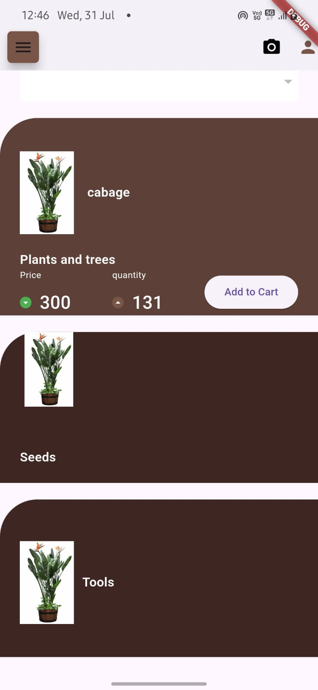
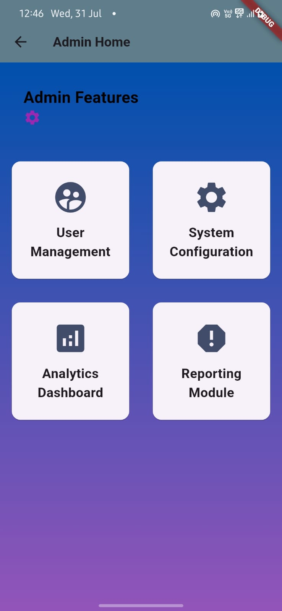
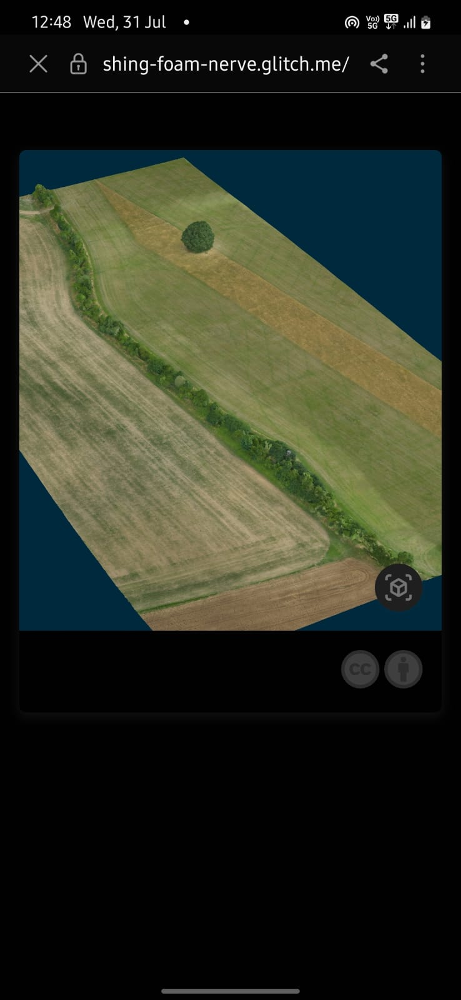

# Kishan Shayak 

## Overview

This project demonstrates the integration of advanced technologies such as Flutter, Firebase, Machine Learning, and Unity to create a comprehensive platform for inventory management and market transactions. The platform leverages Augmented Reality (AR) to enhance inventory analysis and provides a marketplace for farmers to efficiently manage and optimize their sales.

## Features

- **Advanced AR Technology:** Utilized AR to perform efficient inventory analysis and generate statistical insights, enhancing the accuracy and speed of inventory management.
  
- **Farmer Marketplace:** Developed a platform where farmers can list items for sale and purchase. The system is designed to optimize income generation through efficient transactions and market opportunities.

- **In-App Payment Integration:** Seamlessly incorporated payment features to streamline transactions within the platform, making it easier for users to complete their purchases and sales.

## Technologies Used

- **Flutter:** For building the cross-platform mobile application.
- **Firebase:** For backend services including authentication, database, and cloud storage.
- **Machine Learning:** To provide intelligent insights and recommendations.
- **Unity:** For advanced AR features and interactive experiences.

## Screenshot 





## Setup

1. **Clone the Repository:**

   ```sh
   git clone https://github.com/your-username/your-repository.git
   cd your-repository


## Feedback

We welcome feedback from users and contributions from the community to further enhance the Medical Learning App. Feel free to submit bug reports, feature requests, or pull requests to help us improve the app and make it even more valuable for medical students worldwide.

## 🚀 About Me
Hey there! 👋 I'm Tanish , a seasoned Flutter developer passionate about creating sleek and efficient cross-platform mobile apps. With 1.5 years of experience, I specialize in crafting delightful user experiences and optimizing app performance. Let's build something amazing together!
